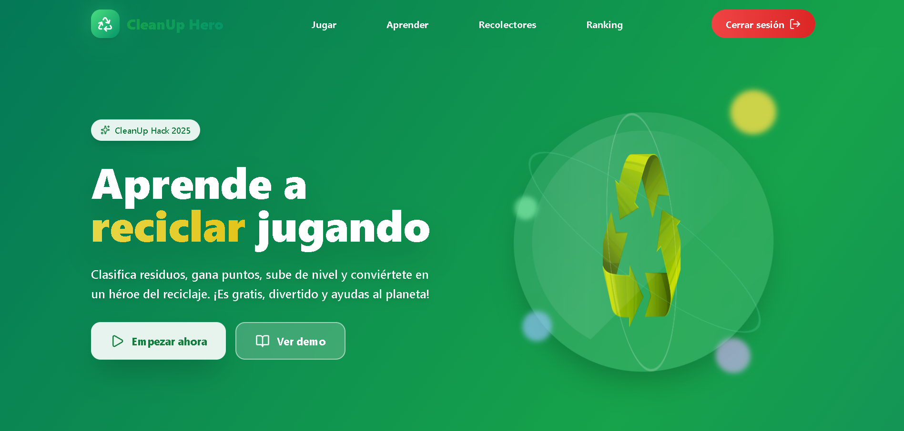
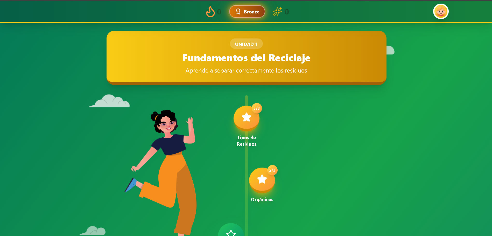
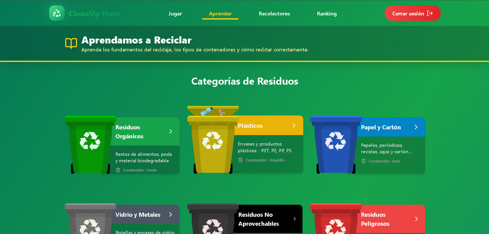
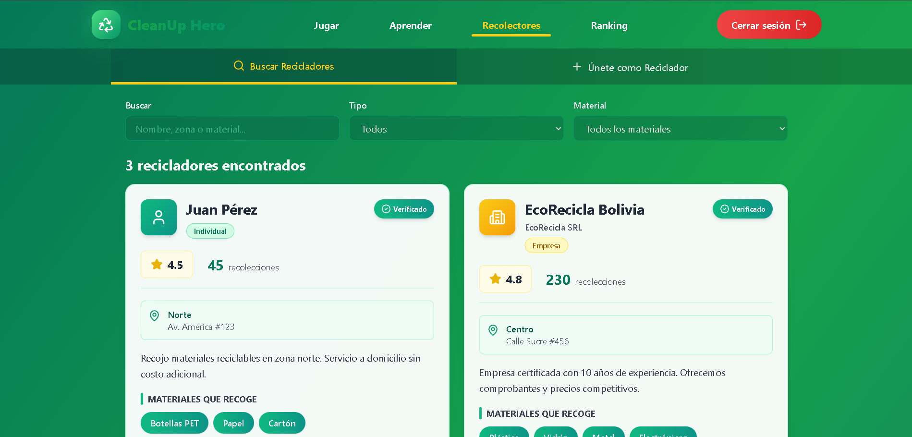
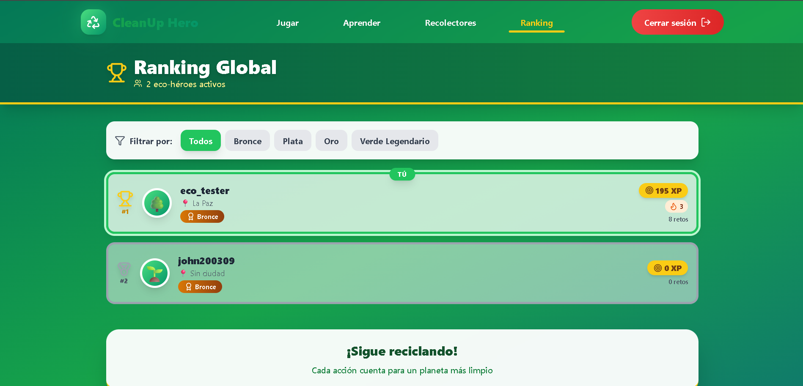

# 🌱 EcoQuest - Gamificación del Reciclaje

<div align="center">


**Transforma el reciclaje en una aventura de aprendizaje**

</div>

---

## 🎯 Sobre el Proyecto

**EcoQuest** es una plataforma web responsive que gamifica el aprendizaje sobre clasificación de residuos y gestión de reciclaje. Inspirado en la mecánica de Duolingo, combina educación ambiental, tecnología y conexión comunitaria para crear un ecosistema completo de reciclaje.

Desarrollado para **CleanUp Hack 2025** - Hackathon Cochabamba.

---

## ✨ Características Principales

### 🎮 Sistema de Gamificación

- **Niveles Progresivos**: Cada nivel se enfoca en un tipo específico de residuo
- **Desafíos Diarios**: Retos de clasificación para mantener el engagement
- **Sistema de Puntos y Logros**: XP, racha de días consecutivos y badges desbloqueables
- **Ranking Global**: Compite con otros usuarios por el top del reciclaje

### 🔗 Conexión Comunitaria

- **Marketplace de Recicladores**: Conecta hogares con recicladores independientes
- **Perfil de Recicladores**: Sistema de registro para profesionales del reciclaje
- **Geolocalización**: Encuentra recicladores cercanos a tu ubicación
- **Sistema de Contacto Directo**: Chat o llamada integrada para coordinar recolecciones

### 📚 Centro de Aprendizaje

- **Biblioteca Educativa**: Artículos sobre tipos de residuos, historia del reciclaje y mejores prácticas
- **Guías Interactivas**: Tutoriales paso a paso sobre clasificación correcta
- **Estadísticas de Impacto**: Visualiza tu contribución al medio ambiente
- **Quiz Educativos**: Pon a prueba tus conocimientos

## 🛠️ Tecnologías Utilizadas

### Frontend

- **React.js** - Framework principal
- **Tailwind CSS** - Estilos y diseño responsive
- **Lucide React** - Iconografía
- **React Router** - Navegación

### Backend & Servicios

- **Supabase** - Base de datos principal

## 🚀 Instalación y Uso

### Prerrequisitos

```bash
Node.js >= 16.x
npm >= 8.x
```

### Instalación

1. **Clonar el repositorio**

```bash
git clone https://github.com/link200309/Project-HackathonCleanUp-2025.git
cd ecoquest
```

2. **Instalar dependencias**

````bash
cd client
npm install


3. **Configurar variables de entorno**

```bash
cp .env.example .env

# Supabase Configuration
VITE_SUPABASE_URL=...
VITE_SUPABASE_ANON_KEY=...

# App Configuration
VITE_APP_NAME=EcoQuest
VITE_APP_VERSION=1.0.0
````

4. **Iniciar la aplicación**

```bash
# Frontend (en otra terminal)
cd frontend
npm run dev
```

La aplicación estará disponible en `http://localhost:5173`

## 📱 Capturas de Pantalla

<div align="center">

### Pantalla Principal de Juego







</div>

---

## 🎯 Roadmap

- [x] Sistema de autenticación y perfiles
- [x] Niveles básicos de clasificación
- [x] Integración con cámara
- [x] Marketplace de recicladores
- [ ] App móvil nativa (iOS/Android)
- [ ] Sistema de recompensas físicas
- [ ] Integración con municipios
- [ ] Expansión internacional
- [ ] Gamificación para empresas

---

## 🤝 Contribuciones

Las contribuciones son bienvenidas y apreciadas. Para contribuir:

1. Fork el proyecto
2. Crea una rama para tu feature (`git checkout -b feature/AmazingFeature`)
3. Commit tus cambios (`git commit -m 'Add some AmazingFeature'`)
4. Push a la rama (`git push origin feature/AmazingFeature`)
5. Abre un Pull Request

---

## 👥 Equipo

**EcoQuest Team** - CleanUp Hack 2025

- 🎨 **Diseño UX/UI** - [Nombre]
- 💻 **Desarrollo Frontend** - [Nombre]
- ⚙️ **Desarrollo Backend** - [Nombre]
- 🤖 **Machine Learning** - [Nombre]

---

## 📄 Licencia

Este proyecto está bajo la Licencia MIT - ver el archivo [LICENSE](LICENSE) para más detalles.

---

## 🌟 Agradecimientos

- **CleanUp Hack 2025** por la oportunidad
